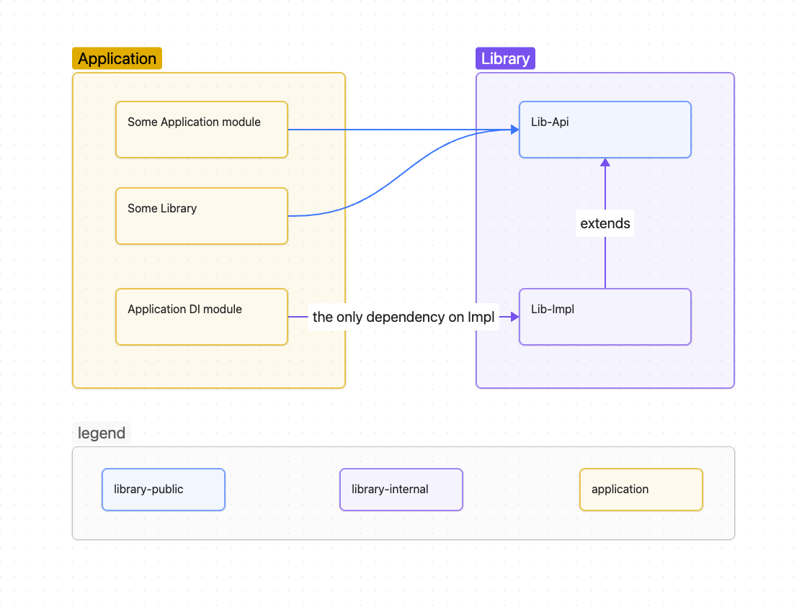

# Manual DI in Kotlin Multiplatform: a composition root instead of a framework

A Kotlin Multiplatform app can be assembled without a DI framework. No reflection, no code generation, no annotations or DSL. Dependency injection comes down to a single idea: there is one place where shared components are created, the composition root, and every other class receives its ready dependencies through its constructor.

The composition root itself is neither an invention nor anything specific to KMP. The term was popularized by Mark Seemann, author of the book "Dependency Injection," who described it as the single point where the whole object graph of an application is assembled ([ploeh.dk](https://blog.ploeh.dk/2011/07/28/CompositionRoot/)). The pattern works the same way in .NET, on the backend, in Python, in any modular application that wires its dependencies at one entry point. KMP adds one platform-specific axis to it: the source-set hierarchy. More on that below: the container hierarchy mirrors the source-set hierarchy, and each component's place is determined by which API its source set can see.

Why bother with manual DI when mature frameworks exist? The main reason is transparency. The dependency graph here is ordinary code: you can see what is created and where, and you can follow any link through "go to definition" in the IDE. No magic, no objects "out of thin air"; what a framework hides behind annotations and code generation lies here in plain text. The rest follows from transparency: zero cost of entry (no plugin, no build configuration, no version conflicts), debugging with an ordinary debugger over the code, a low barrier for a new person on the team, who has nothing to learn beyond the project and reads it like any other Kotlin.

This is not a refusal of the tool on principle. A framework solves real problems, and on a large project it can pay for itself. But it also adds a compiler plugin or KSP, its own build lifecycle, its own rules, and its own learning curve. Until the problems it solves are actually there, it stays a piece of machinery heavier than the task. What follows is how manual DI is built in [Tether](https://github.com/khmelevartem/tether), a KMP app for transferring files between devices (Android, iOS, Desktop), and where the line runs past which a framework starts to earn its keep.

The code in the examples is synthetic: class names are generalized to show the shape of the pattern rather than a specific implementation. The patterns themselves are taken from production code.

## The core idea: a composition root

The composition root is the single place where the application assembles its dependency graph. This place is conventionally called the container. The container is the only thing that creates components, all the entities in the graph the application owns: interactors, repositories, data sources, and hands them to everyone who needs them. Nobody but the container calls a component's constructor.

```kotlin
open class AppContainer {
    open val httpClient: HttpClient by lazy { HttpClient() }
    open val messageRepository: MessageRepository by lazy { MessageRepository(httpClient) }
    open val syncEngine: SyncEngine by lazy { SyncEngine(messageRepository) }
}
```

The fields here are lazy, but that is a detail: the order and moment of creation are set by the container, not by the accident of access. Where laziness is not needed, the component is assembled right away; where `by lazy` gets in the way with its synchronization, use `LazyThreadSafetyMode.NONE`. A field need not be a singleton: instead of a ready object, the container may hold a factory that builds a new instance on each call.

Each component receives its dependencies through the constructor. The `SyncEngine` class does not know where `MessageRepository` came from; it accepts it. That is dependency injection: the caller passes the dependency in.

The main advantage shows up immediately in tests. Since `SyncEngine` takes `MessageRepository` through the constructor, a test passes a fake there: no mocks, no reflection, no swapping of globals.

## Advantages of the approach

- **Transparency.** The dependency graph is ordinary Kotlin code: you can see what is created and where, and you can follow any link in the IDE. No magic and no objects "out of thin air."
- **Honest constructors.** A class's signature is its full list of dependencies. Nothing arrives from an invisible global.
- **The structure hints at where to create a component.** The container tree mirrors the source-set tree, and a component's place is where the required API first becomes visible ([Container hierarchy](#the-container-hierarchy-mirrors-the-source-set-hierarchy)).
- **A thin integration layer.** The split into Api and Impl strictly marks a module's public surface ([Splitting into Api and Impl](#splitting-into-api-and-impl)).
- **No external dependencies.** DI pulls not a single third-party library into the project: no build plugin, no runtime artifact, no versions to update and reconcile with one another.
- **Someone else's responsibility does not leak into feature code.** Feature code stays ordinary Kotlin, without DI annotations and code generation. Wiring lives only in the composition root, not smeared across the classes it serves.
- **The right direction of dependencies.** A component does not know where it will be used and does not reference its usage context. That keeps it reusable, while all knowledge of where it is applied stays in the root.
- **Libraries and internal modules are handled the same way.** An internal module and a published library are assembled with one technique: Api/Impl plus a factory. So a module can be moved into a separate repository without rework when it needs to be reused.
- **A cheap move.** Containers and providers are already close in shape to a framework's graph: you can migrate without structural changes ([Migrating to a framework](#migrating-to-a-framework)).
- **Easier for AI agents.**

### Manual DI and development with AI agents

Transparency has a second consumer nobody thought about five years ago: the AI coding agent. Tether evolves in tandem with such agents, and manual DI is advantageous here for the same reason it is for a human: the dependency graph lies in the code as explicit text, without the framework's magic.

When an agent edits a feature, it needs to understand what is passed where. With manual DI it simply reads that: the constructor is an honest list of dependencies, the assembly point is a single file, any link is visible through go-to-definition. A framework hides half of this behind annotations and code generation, and the agent has to keep the framework's rules in mind and reconstruct the invisible graph from indirect cues. The less magic, the less the agent has to guess at what is not visible in the code.

The same source gives checkability. The set of manual-DI principles ("dependencies through the constructor," "don't reach into a global," "a singleton is created once in the root") is a short checklist against which both a human and an agent reviewer verify new code. In Tether this checklist is written up as an instruction for agents on what counts as correct DI. The manual approach makes it enforceable: what you check is ordinary code, not the behavior of a framework.


## This is DI, not a service locator

A common objection to manual DI: in practice it degenerates into a service locator, a global registry from which classes pull dependencies themselves. For constructor injection this objection does not hold. The difference is the direction of control: with a service locator the class knows about the registry and pulls dependencies from it; with constructor injection the class knows of no container at all, and the composition root passes dependencies into it. The container here is the place of assembly, and classes do not read from it. [Martin Fowler](https://martinfowler.com/articles/injection.html) examined this boundary in detail.

One exception: Android components with empty constructors are forced to reach the container themselves. This is a local service locator at the boundary with someone else's framework; details are in the section [The Provider pattern for Android](#the-provider-pattern-for-android).

The same place answers the frequent question "why not Koin." Koin also does without code generation and a plugin and is native to KMP, but its wiring resolves at runtime by default: a dependency is pulled from a registry on request, the graph is not visible in the code, and a forgotten registration surfaces not as a compile error but as a runtime crash. This is exactly the service locator with an invisible graph that manual DI walks away from.
## Principles of manual DI

The composition root rests on a few rules.

**Constructor injection only: components do not create components.** A class's constructor is its honest list of dependencies. Anything the class pulls from globals or creates internally is invisible on that list.

```kotlin
// bad: the class creates and owns another class itself; it can't be replaced in a test
class SyncEngine {
    private val repo = SomeRepository()
}

// good: the dependency is explicit
class SyncEngine(private val repo: SomeRepository)
```

The same applies to a `nullable` dependency defaulting to `= null`. If the production build always passes the component but the signature makes it optional, a call that forgets it silently disables the feature with no compile error. Make such a dependency required. Keep the `null` default only for a genuinely optional dependency, and then test the branch with `null`.

**Platform context is a dependency, not a global.** The entry point already holds the application `Context`. Pass it into the constructor instead of reaching into a static field.

```kotlin
// bad
actual class SyncEngine {
    private val manager = GlobalApp.context.getSystemService(/* … */)
}

// good
actual class SyncEngine(context: PlatformContext) {
    private val manager = context.getSystemService(/* … */)
}
```

**One singleton, one owner.** If a component is meant to be a singleton, it is created exactly once, in the composition root, not in a separate `object` and not inside another component. And if, on the contrary, you need a fresh object every time, or one cached by its own rules, the container holds a factory or a registry: they own the creation rules and offer convenient methods with a minimum of arguments.

**Don't create dependencies inside a composable.** A composable that assembles a service itself is a composition root in the wrong place. The crude case is obvious: without `remember`, every recomposition spawns a new instance and discards it right away, a leak and a dead object. But even the careful variant with `remember` is wrong:

```kotlin
@Composable
fun SomeScreen() {
    val engine = remember { SyncEngine(SomeRepository()) }
    DisposableEffect(Unit) {
        engine.start()
        onDispose { engine.stop() }
    }
}
```

`remember` removes the leak but not the main mistake: the composable owns a singleton's lifecycle, which the entry point should own. The correct shape is to assemble the container at the entry point and pass the ready component in.

**The container holds named components, not plain data.** A container field is an object that owns or manages something: a store, a server, a client, a coroutine scope, a factory. Not a string, a number, a port, or a tag.

Any value implicitly carries logic, of the domain or of the data layer. Putting a ready `deviceId` string into the container means hardcoding the decision "this value is available immediately, always, and to everyone." But where does it come from? Perhaps it has to be read from disk, generated on first launch, awaited after a network response. That logic belongs to someone, to the component responsible for `deviceId`. The container does not own logic, even logic this simple; it only assembles the components that own it.

```kotlin
// bad: the container owns data and hardcodes "available immediately"
class AppContainer {
    val deviceId: String = readDeviceId()
}

// good: the container assembles the owner, which yields the value when it is ready
class AppContainer {
    val identity: DeviceIdentity by lazy { DeviceIdentity(storage) }
}
// the consumer asks identity.deviceId() at the right moment — including after I/O
```

Plain data on the container forces it to be materialized at assembly time, hides who is responsible for it, and turns the dependency graph into a property bag.

**No silently-throwing common defaults.** When a container field requires a per-platform implementation, the common contract says so explicitly: the field is `abstract` on the common container, so every platform leaf is obliged to provide it or it won't compile. A concrete common default that throws and works only because one platform happened to override it is the worst case: it compiles, passes fake-based tests, and crashes at runtime on the platform that forgot to override it.

## The container hierarchy mirrors the source-set hierarchy

In a KMP app there is a whole tree of containers. It mirrors the source-set tree. Each layer adds only what its source set is able to see.


```
AppContainer            (commonMain)
├── JvmAppContainer     (jvmMain)
│   ├── AndroidAppContainer  (androidMain)
│   └── DesktopAppContainer  (desktopMain)
└── AppleAppContainer   (appleMain)
    └── IosAppContainer      (iosMain)
```

`AppContainer` in `commonMain` assembles everything expressible in shared code. `AndroidAppContainer` in `androidMain` adds components that need a `Context` or some other Android API. `IosAppContainer` adds whatever requires Apple frameworks. A platform leaf (a terminal node of the tree, a `leaf`) inherits the common container and fills in what's missing.

The boundary runs along API visibility. If a component is built from shared abstractions, it lives in the common container. If it needs a platform type, it drops down into the platform leaf. A component is created where the required API first becomes visible.

In the diagram, the intermediate `jvmMain` as a shared parent of `androidMain` and `desktopMain` is a configured source-set hierarchy, not KMP's default shape: in the default structure Android and JVM sit side by side under `commonMain` with no shared jvm layer, and a combined `jvmMain` is enabled by the hierarchy template in Gradle.

## Platform entry points

A platform has as many container leaves as it has entry points. Each entry point assembles its own leaf and hands components down.

- On **Android** the container is assembled in an `Application` subclass and lives as long as the process.
- On **iOS** the container is assembled in the UI entry point, for example in `MainViewController`.
- On **Desktop** there can be several entry points. A GUI launch and a CLI launch (`main`) are two different entry points, and each assembles its own leaf; only what it needs lands on each compilation's classpath.

The entry point owns the lifecycle, and so the scope of the dependency graph it created is bounded by exactly its lifetime.

## Configuration: the container's input

The container needs values that only the entry point knows: the server port, the downloads directory, a reference to the Android `Application`. These values are gathered into a separate config object whose hierarchy mirrors the container hierarchy. Config holds not only plain values from strings, numbers, or flags. Objects with their own behavior land there too: a transport or data-source implementation, a set of UI settings for the app version, a choice of monetization model, B2B or B2C. And unlike the resulting container, here plain values are allowed (more in [Principles of manual DI](#principles-of-manual-di))

```kotlin
// commonMain
interface AppConfig {
    val downloadsDir: String
    val port: Int
}

// androidMain
interface AndroidAppConfig : AppConfig {
    val application: Application
}
```

The container takes the config through its constructor. `AppContainer` in `commonMain` is no-arg; intermediate containers take their `AppConfig` subtype; leaves pass a concrete config up.

Config is the settings that come in as input. The container is what gets assembled by applying those settings. The split gives exactly one place where the application sets parameters and a separate place where the graph is built from them.

## The Provider pattern for Android

Android comes with a complication of its own. Its system components, `Activity`, `Service`, `BroadcastReceiver`, are created by the framework, and they must have empty constructors. You can't pass them the container through the constructor like a normal class.

The solution that fits this situation:

1. The `Application` subclass implements a provider interface and owns the container.
2. System components reach the container through a cast: `(application as AppContainerProvider).container`.


```kotlin
interface AppContainerProvider {
    val container: AppContainer
}

class MyApp : Application(), AppContainerProvider {
    override val container: AppContainer by lazy { AndroidAppContainer(/* config */) }
}

class MyService : Service() {
    private val container by lazy { (application as AppContainerProvider).container }
}
```

In essence this is a service locator as a forced compensation for a platform limitation. Access to it is restricted to Android classes only. Ordinary Kotlin classes receive their dependencies through the constructor. The limitation here is the platform's, not specific to manual DI: every framework invents its own workarounds at this point.

The technique itself is documented by Android as a way of doing manual DI ([Manual dependency injection](https://developer.android.com/training/dependency-injection/manual)), though there it is presented as a step before Hilt. Here it stays a standalone solution until the triggers from the framework section fire.

## Composing the container

The container hierarchy described above assembles the graph through inheritance: a leaf finishes what the common container has already defined. Inheritance can be replaced or supplemented by composition. Using composition is justified when you need to factor a container out along a separate axis. Take the same platform axis as an example. `AppContainer` may not be overridden but instead take a platform container as a constructor parameter.

```kotlin
// the main container is assembled from an axis fragment
class AppContainer(
    private val platformContainer: PlatformContainer,   // AndroidContainer | IosContainer | DesktopContainer
) {
    val userRepository: UserRepository by lazy { UserRepository(platformContainer.userCredentialsStore) }
}
```

We isolate any such axis, factor it out into a separate container fragment, and substitute the right fragment at assembly time. There can be several axes.

- **Build flavor.** Free and paid differ in their set of dependencies. The shared part of the graph lives in the main container, and the differing part in `FreeContainer` and `PaidContainer`; the assembly point substitutes the right fragment for the current flavor.
- **UI variant.** The old and the new interface pull different presentation dependencies. They are factored out into `OldUiContainer` and `NewUiContainer`, and the graph ends up with exactly the one the build enabled.

```kotlin
// the main container is assembled from an axis fragment
class AppContainer(
    private val flavor: FlavorContainer,   // FreeContainer | PaidContainer
) {
    val featureGate: FeatureGate by lazy { FeatureGate(flavor.entitlements) }
}
```

The main advantage, transparency, shows up here too. When a separate axis can and should be factored out, it is most likely a candidate for a separate module or a standalone library. Manual DI only highlights the option but lets you leave things as they are.

## Testability

The container is also the seam through which tests substitute fakes. For this to work, container fields are declared as `open val` or `abstract val`: overriding is the substitution mechanism. No setters, no `lateinit var`.

```kotlin
class FakeContainer : AppContainer() {
    override val httpClient = FakeHttpClient()
    override val messageRepository = FakeMessageRepository()
}
```

A test assembles a fake container by inheritance and overrides only the fields it needs, without spawning a class per scenario. Components that take their dependencies through the constructor are tested directly: they don't need the container at all; it exists for the sake of production assembly.

To test Android components under Robolectric you need an `Application` that implements the provider interface. Either the production `Application` is used, or a test one with a fake container is defined, and each test gets a fresh instance, with nothing settling into a static.

## Limits of the approach

An honest caveat about what manual DI does not give you.

### It's a set of principles, not an enforcement mechanism

Nothing in it stops you from creating a dependency right inside a class or hiding state in an `object`. By the same token, no framework forbids writing badly. The difference is that here a violation is visible to the eye: an extra constructor call or a reach into a global sticks out in the code and in the diff. If you need guarantees, that is the level of custom linters; without them, what's left is the team's engineering culture.

### Checking graph connectivity

A forgotten dependency is caught by the compiler anyway: a constructor with no argument can't be called, so "forgot to provide X" simply won't compile. The only gap is cyclic dependencies through lazy fields (`by lazy`): when two components reference each other, the cycle surfaces at runtime on first access, whereas a graph-validating framework catches it at build time. The gap is narrow and singular; besides, a cycle that surfaces is a real design problem caught rather than hidden, so it's hard to call this a clean loss.

### Scopes

Manual DI has no built-in mechanism for scopes. All containers are singletons for the whole process: there is no child graph per screen, no dependency bound to a lifecycle, no unloading part of the graph from memory when it is no longer needed. This is exactly what mature frameworks provide.

Objects that live exactly while a screen is open are owned by the navigation or screen layer, in ordinary Kotlin: they arrive in a constructor from above or are created on the spot, and are released together with their owner when it closes. This is enough as long as there are few lifecycle owners and they are expressed as explicit classes. When you need DI-managed scopes, lifecycle-bound dependencies, or unloadable features, the answer comes from a framework (see [Migrating to a framework](#migrating-to-a-framework)).

The container holds process-wide singletons, and `Closeable` components like `HttpClient` are closed together with the process or the `Application`; manual DI has no separate unloading of the graph from memory. Where a component lives shorter than the process, the same ownership principle applies: `close()` is called by whoever owns its lifecycle, which is manual work; there is no automatic release here.

## How this scales to libraries and modules

While the application is a single module, the composition root stays flat. But the same approach grows to standalone KMP libraries and to composing modules inside an application, and there one more cut appears: what a module or library exposes outward and what it hides.

### Splitting into Api and Impl

A library or module splits in two. The **Api** module holds only interfaces and models for external use. The **Impl** module depends on Api and holds all the implementations.

This split may look contrived, but in fact it is a continuation of the same composition-root principle, only at the module level. So far we have discussed the single point where components are _created_. The split into Api and Impl raises that same principle one level higher: the implementation is *seen* by only one place, the module that assembles DI. All other modules compile against Api and know nothing of Impl's existence.

The value here is control over who is even allowed to depend on the implementation. Since only the DI module (the assembly-point module) looks at Impl, which object stands behind an Api interface is the assembly point's decision, and consumers are not involved.

A telling case is an optional or loadable feature. The decision "is the implementation available and which version to bring up" is made exactly once, in the composition root. Not available: the root puts a stub behind the same Api interface or handles the case differently. Available: it resolves and substitutes the real Impl. And how it was delivered, an Android dynamic feature, a separate download from remote storage, picking the right `.so` for runtime conditions, does not matter to the rest of the code: consumers hold only Api and call the functionality directly, without a single "is this loaded" check.



### Public and internal containers

A library's container forks by visibility.

- **LibPublicContainer**: the library's public API (façade). Declared in the Api module. It holds all the dependencies the library hands to external consumers.
- **LibInternalContainer**: a descendant of the public one, declared in the Impl module. Adds dependencies for internal use. External consumers don't see its type, so it is physically impossible to rely on it from outside the library.


```kotlin
// Api module
interface LibPublicContainer {
    val someRepository: SomeRepository
}

// Impl module
interface LibInternalContainer : LibPublicContainer {
    val someInternalService: SomeInternalService
}
```

### The library entry point

Someone has to assemble the container, build out the platform part, hold the assembly order. This assembly lives in the Impl module, beyond the Api boundary, and sticks out a single factory function:

```kotlin
// Impl module — visible only to the app's DI module
fun createLibContainer(config: LibConfigContainer): LibInternalContainer = LibContainerImpl(config)
```

The function assembles the internal container's implementation, which holds all the library's internal classes, each of which already received its dependencies through the constructor at creation. The app's DI module is the only one that sees Impl, so it holds the container by the internal type and hands the public façade outward:

```kotlin
class App {
    val libContainer: LibPublicContainer by lazy {
        createLibContainer(AndroidLibConfig(application = this))
    }
}
```

An honest caveat: `createLibContainer` lives in the Impl module, so the app's DI module takes Impl as a dependency. If, in this module, you break the agreement "the internal container is for initialization only, and you use the library through the public one," the designed boundaries leak. In pure Kotlin without reflection there is no protection from this: what's left is custom linters, obfuscation (where applicable), or the team's discipline.

From there, the ready container just has to be passed into the constructors of external consumers:

```kotlin
val someInteractor: SomeInteractor by lazy {
    SomeInteractor(repository = libContainer.someRepository)
}
```

### Static access from inside the library

Sometimes the library's own internal classes need to reach the container statically, the same story as with Android components, and the same caveat: it is a local service locator at the boundary with a framework. To keep it from leaking outward, the provider is typed to exactly what the caller needs. From the outside, `LibProvider` with the public type is available; it is declared in Api. Internal code needs the internal container, so for it there is a separate `LibInternalProvider` with the internal type, declared in Impl and not visible outward.

```kotlin
// Api module: public provider
interface LibProvider {
    val lib: LibPublicContainer
}

// Impl module: provider for the internal container.
// Not visible outward, not because of a modifier, but because Impl isn't on consumers' classpath.
interface LibInternalProvider {
    val internalLib: LibInternalContainer
}

// in the app, one and the same App hands out both faces of the container
class App : Application(), LibProvider, LibInternalProvider {
    private val container: LibInternalContainer by lazy {
        createLibContainer(AndroidLibConfig(application = this))
    }
    override val lib: LibPublicContainer get() = container          // outward — the public façade
    override val internalLib: LibInternalContainer get() = container // inward — the extended one
}

// inside the library — one cast, and with a wrong build it fails with a clear error
class LibActivity : Activity() {
    override fun onCreate(savedInstanceState: Bundle?) {
        super.onCreate(savedInstanceState)
        val provider = application as? LibInternalProvider
            ?: error("Application must implement LibInternalProvider")
        provider.internalLib.someInternalService.start()
    }
}
```

A separate internal provider gets rid of the double cast `as? … as?`, in which two different misses would merge into one silent branch and the internal `start()` would simply not happen. Here there is a single cast, and with a wrong build it fails with `IllegalStateException` rather than silently disabling the feature.

## Migrating to a framework

The structural trigger for adding a framework is essentially one: **scopes and lifecycle-bound dependencies**, when the graph needs a lifetime bound and explicit unloading from memory.

Not a trigger but an extra cost: many frameworks implement methods that simplify obtaining a ViewModel. With MVVM and the manual approach you'll have to wire up model factories by hand and use the standard ViewModelStore.

The move is cheap, though: containers and providers are already close in shape to a framework's graph, the container becomes the dependency graph, platform fragments and config become contributions to it, and `open val` tests become graphs with overridden bindings. Which framework exactly to pick is a separate conversation; for KMP you look at support for all targets, compile-time graph validation, and ergonomics in a multi-module project, and you might consider [Metro](https://github.com/ZacSweers/metro) or kotlin-inject.

## Conclusion

Manual DI rests on a single principle: the dependency graph is assembled in one place, the composition root, and every other class receives its ready dependencies through the constructor. The Api/Impl split and composing the container from parts are the same principle, raised to the module level and spread across the axes along which the application varies.

The price is manual wiring; the gain is transparency: the graph lies in the code, without magic, and reads the same to a human, the IDE, and an AI agent. As long as the graph fits in your head, this is cheap; when it stops fitting, containers and providers are already close in shape to a framework's graph, and the move won't require a structural shakeup.

The idea is not new: a container-façade for KMM with a split into a public and an internal part was described back in 2023 by [Marcin Piekielny](https://medium.com/@maruchin/kmm-architecture-5-dependency-injection-79052c7ea778). What is added here is what makes it genuinely applicable: a container hierarchy by source set across all platforms, the provider pattern for Android, composition by axes, and scaling to modules: Api/Impl, public/internal.

The code this article is based on is open: [github.com/khmelevartem/tether](https://github.com/khmelevartem/tether). The full breakdown of the pattern and the checklist for new code live in `docs/engineering/dependency-injection.md`.
